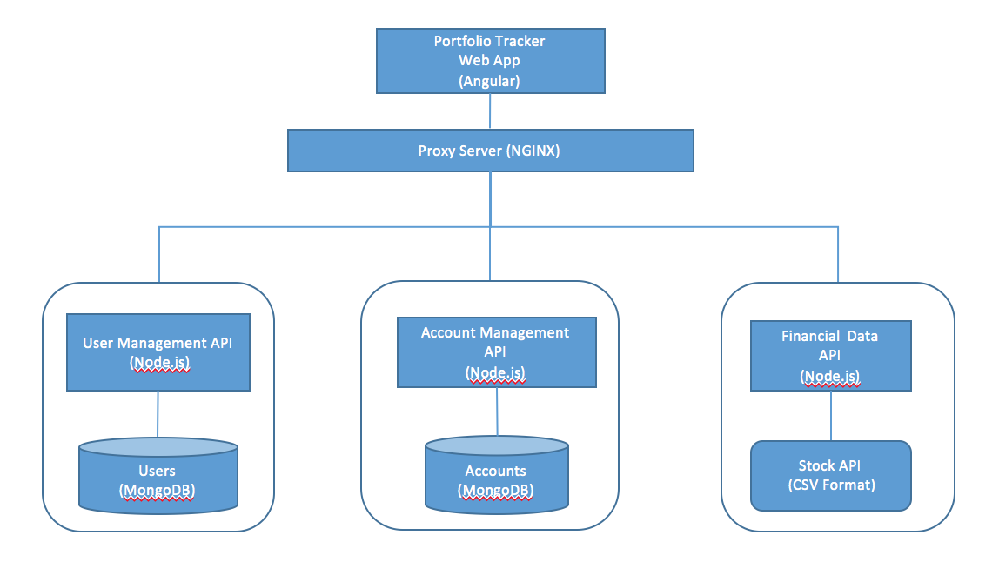

# Portfolio Tracker

This project is a work in progress. Features implemented so far are listed below:

* Basic user management (create, update, change password)
* Create and maintain portfolio which holds a list of stocks (holding)
* Add and maintain holdings within a portfolio
* For a given holding, display the following fields:
    * Stored: symbol, number of shared, purchase date, purchase price, commission
    * Calculated on demand: current stock price, gain/loss
* Retrieve detailed stock quotes for one or more symbols
* Retrieve historical stock quote for a given symbol
* Plot a chart of stock prices for a given symbol within a time range

---------------------------------------
### Microservice Architecture (MEAN Stack) ###

* user-management-api: manages users
* account-management-api: manage user accounts
* finance-api: retrieve financial data
* portfolio-tracker-app: angular web app consuming the above microservices

---------------------------------------
### API Project Directory Structure ###
    XX-api
      |- config (environment-specific configurations, such as MongoDB connection, JWT parameters)
      |- routes (define routes for endpoints)
      |- controllers (implement endpoint logic)
      |- models (define mongoose schemas)
      |- app.js (initialize Express components and connect to database)
      |- server.js (application starting point)

---------------------------------------
### Generate Swagger for API Projects ###
* Run "grunt swagger-docs" to generate swagger docs for each API project
* Swagger Home Page
    * user-management-api: [http://localhost:3001/user-management/api/docs](http://localhost:3001/user-management/api/docs)
    * account-management-api: [http://localhost:3002/account-management/api/docs](http://localhost:3002/account-management/api/docs)
    * finance-api: [http://localhost:3003/finance/api/docs](http://localhost:3003/finance/api/docs)
* To execute secured endpoints, at the top of swagger home page, enter admin/admin and click "Set Token" to authenticate once

---------------------------------------
### Build and Run Locally ###
* Prerequisites: 
    * Install MongoDB, Node on your local machine
    * Install these NPM modules:  "npm install -g bower nodemon grunt-cli"
* Build API projects by running "npm install"
* Create and seed database by runnning "/scripts/init.js"
* Start API by running "node server" or "nodemon server"
* Build Web App project by running "npm install" and then "bower install"
* Start Web Application by running "grunt serve"
* API and Web Application URL: 
    * user-management-api: [http://localhost:3001/user-management/api](http://localhost:3001/user-management/api)
    * account-management-api: [http://localhost:3002/account-management/api](http://localhost:3002/account-management/api)
    * finance-api: [http://localhost:3003/finance/api](http://localhost:3003/finance/api)
    * portfolio-tracker-app: [http://localhost:4000](http://localhost:4000)

---------------------------------------
### Deploy and Run Microservices using NGINX ###
NGINX can be used to proxy requests to all API's. This is one way to enable Web App to seamlessly consume REST API served from a different origin. 
Otherwise, it will encounter CORS issue (Cross-Origin Resource Sharing). 

* Install NGINX
* copy '/scripts/nginx.conf' to your local installation (ex: /usr/local/etc/nginx/nginx.conf)
* Start each API by running "node server" or "nodemon server"
* Start NGINX (ex: "sudo nginx")
* All API's can be accessed without port number
    * User Management: [http://localhost/user-management/api/docs](http://localhost/user-management/api/docs)
    * Account-Management: [http://localhost/account-management/api/docs](http://localhost/account-management/api/docs)
    * Financial Data: [http://localhost/finance/api/docs](http://localhost/finance/api/docs)
    * Web Application: [http://localhost/](http://localhost)
    
---------------------------------------
### Microservice Implementation Overview ###
The microservices are implemented with Express using Token-based security, the following node modules are used:

Node Module  | Usage
------------- | -------------
Common API util project | ( https://github.com/bchan01/common-api-utils)
bcrypt  | password encryption
jsonwebtoken  | generate and verify JWT token
mongoose | MongoDB persistence
Q | handle Async callbacks
lodash | useful utilities
papaparse | convert CSV to JSON
grunt swagger-docs | generate swagger

---------------------------------------
### Web Application Implementation Overview ###
Portfolio Tracker Web Application is a single-page Web App implemented in Angular, the following components are used:

Component | Usage
------------- | -------------
grunt | serve web application (locally)
grunt-connect-proxy | proxy request to API's (work around CORS issues)
angular-jwt  | deals with JWT token
angular-smart-table | table display
bootstrap | styling
